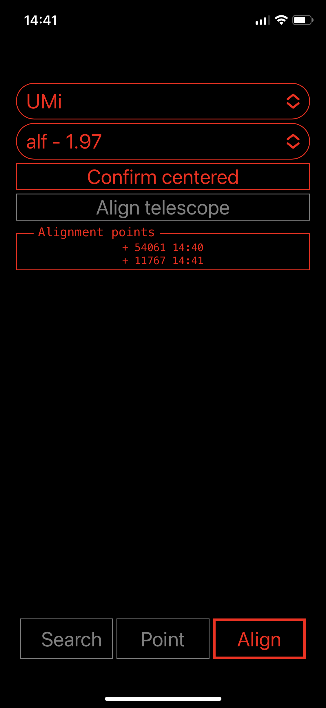
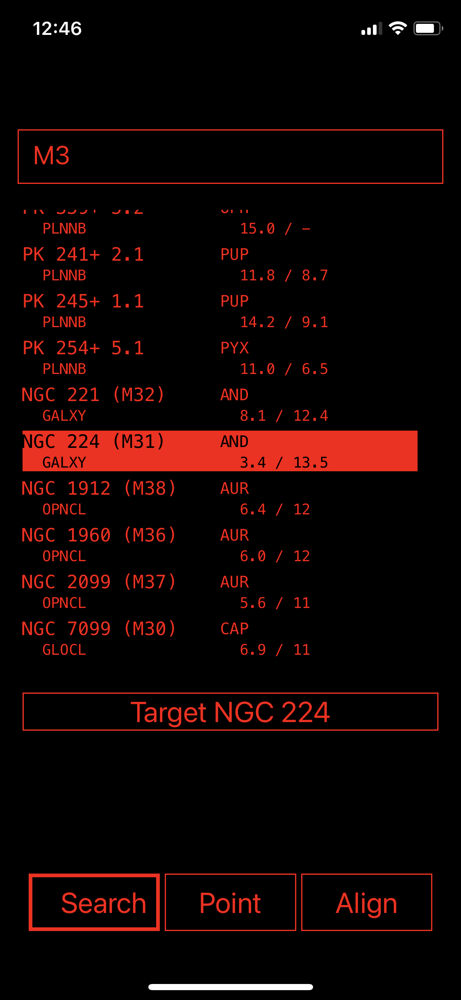
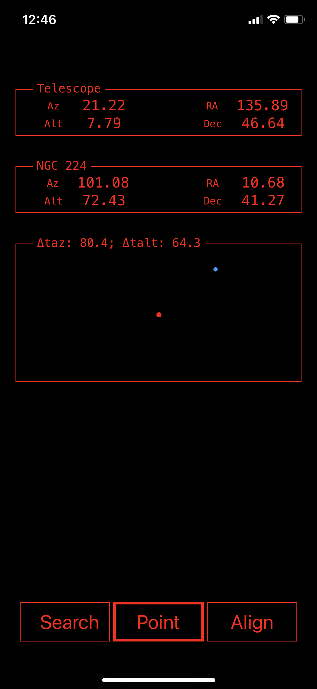

# DobSense


DobSense is a do-it-yourself project that helps locating objects in the sky with your dobsonian telescope.

It's a web application hosted on a Raspberry Pi Zero 2 W and it's accessible from a smartphone. The application senses your telescope's orientation via incremental encoders, and will provide visual guidance to point your telescope towards the desired object. The application does not require Internet connectivity.

DobSense's main purpose is to have fun with software, electronics and drilling. The same HW/SW platform could be extended to support motorized GoTo capability or cooling fan control.
There are many alternatives if you are looking for turn-key solutions, some of which don't require any hardware besides a smartphone. See for example [Astrohopper](https://github.com/artyom-beilis/skyhopper/blob/main/README.md).

## Project status
DobSense is work-in-progress. Its software is reasonably complete, with the notable exception of the Pico microcontroller routines. I'm currently designing the schematics for its hardware board.


## How it works (user)

Place your telescope as usual. It does not need to be on a horizontal surface or point in any particular direction. The application will figure out its orientation during the alignment procedure.
Turn on DobSense and wait until it boots. Then, using the web UI, perform the initial alignment by pointing your scope towards three known stars.
The application will compare the angles from the encoders to the positions of those stars, and derive its own orientation.
You can then use the UI to search for a celestial object and DobSense will show you where to point your scope to find it.

Here are some images that illustrate its usage:

<table>
  <tr>
    <td align="center" width="33%">
      <br>
    </td>
    <td align="center" width="33%">
      <br>
    </td>
    <td align="center"  width="33%">
      <br>
    </td>
  </tr>
  <tr>
  <td>1. Point your scope towards a known star and mark it as "centered". Once you have three stars, you can align it. You can add more stars for increased accuracy, and remove points added by mistake.</td>
  <td>2. Use the Search UI to pick a target. The search is over a local copy of the <a href="https://www.saguaroastro.org/sac-downloads/">Saguaro Astronomy Club database v8.1<a>.</td>
  <td>3. The Point UI will guide you to move your telescope (red dot) until it overlaps with the targeted object (blue dot).</td>
  </tr>
</table>

## Some caveats if you want to play with it

- You'll need to find a way to install incremental encoders on your telescope. This might involve drilling, sawing, etc.
- You'll need to buy electronics components, solder, do wiring.
- You'll need to install a self-signed TLS/SSL certificate on your phone, so that the application can retrieve its position from the phone's GPS.
- You'll need to be(come) familiar with a variety of tools, including docker, linux command line, raspberry pi imaging tools.

## How it works (developer)

- The main application is hosted in a Docker container running on a Raspberry Pi Zero 2 W.
- The Pi Zero 2 is connected to a Raspberry Pico microcontroller, and uses it to receive movement information from the altitude/azimuth encoders.
- The main application is implemented in Python and runs on a Tornado web server. Its UI is implemented in React. The UI communicates with its backend over wifi (provided by Pi Zero) using a mix of http (e.g. to download star catalogs) and websockets (e.g. to update the telescope's position).
- When a phone connects to the application, the React app will send the phone's GPS position to the backend.
----
- During the [alignment procedure](./backend/app/alignment/alignment_delegate.py), the application records the measured telescope angles corresponding to each star.
- It then determines the change-of-basis matrices that represent the telescope orientation wrt. the [Alt-Az coordinates](https://en.wikipedia.org/wiki/Horizontal_coordinate_system) using gradient descent ([method here](./documentation/Alignment.md)).
- Once these matrices are known, the app can determine how the telescope should be moved to point at any object in the sky.
- The main application will periodically send coordinate updates to the UI to track changes in the telescope / celestial object positions.

# Software installation

## 1. Raspberry Pi OS installation

Download the [Raspberry Pi Imager](https://www.raspberrypi.com/software/) for your OS.
Flash the Raspberry Pi OS Lite 64-bit on your Pi Zero's SD card.
- set hostname: 'raspberrypi.local'
- set a username and password. You'll use it later to ssh into the Pi.
- configure wireless settings with your home wifi, so that you'll be able to install additional packages later
- make sure to set the correct country code or wifi might not work
- configure access via ssh and password

## 2. Raspberry Pi Configuration

This script will install docker, configure ethernet over usb, configure wifi in access point mode, disable unneeded services, etc.
```shell
ssh raspberrypi.local 'sudo bash -s' < ./pi_zero/prepare_for_app.sh
```

## 3. Build and deploy the Docker image
```shell
image_name=dobsense_arm64

docker buildx build --platform linux/arm64 --tag $image_name .

docker save $image_name | gzip -c | ssh raspberrypi.local "gunzip | sudo docker load"
```

## 4. Restart Pi Zero 2

```shell
ssh raspberrypi.local 'reboot'
```

The configuration script set up PiZero to automatically start a WiFi network in access point mode and run the Docker container when there is no USB connectivity. This corresponds to a "prod" mode when the device expects to be running stand-alone.

## 5. Connect to the app

1. Install the app CA certificate ([security notes](#security)):
    - Go to http://raspberrypi.local/ca.pem
    - (On iPhone) follow instructions to install a new profile

2. Launch the app:
    - Go to https://raspberrypi.local. The app should load
    - (Optional, on iPhone) add the page to your home screen.

# Security

TL;DR: if you are performing the installation yourself, you are fine. However, **you should not use a device you have not configured yourself**.

This app has not been designed to be secure, given its intended usage.
The only real security risk is the installation of a self-made Certification Authority on your phone. An attacker with access to the CA's private key would be able to compromise all internet traffic to/from your phone.
I have taken reasonable care to reduce this risk:
- The CA key is generated on your Raspberry Pi as part of the application's first boot.
- The CA key is encrypted with a passphrase kept in memory only for the duration of the certificate generation procedure.
- The passphrase is discarded after the certificates have been generated.
- All the CA files, including the key, are deleted after certificates have been generated.
You can find the script performing these steps [here](./nginx/cert_gen/generate_certs.sh).


# FAQ

**Why do I need to install a new certification authority? That feels cumbersome and insecure.**

The application requires the user's position to determine the Alt-Az coordinates of celestial objects. It fetches it from the phone using the [Geolocation API](https://developer.mozilla.org/en-US/docs/Web/API/Geolocation_API), which only works over `https`.
Afaik, no companies will a TLS certificate for a `.local` domain, so I have resorted to a custom certificate chain.
One way to work around this problem would be to enter the position manually (e.g. keeping a database of cities). I don't currently plan this but I'd welcome feedback.
